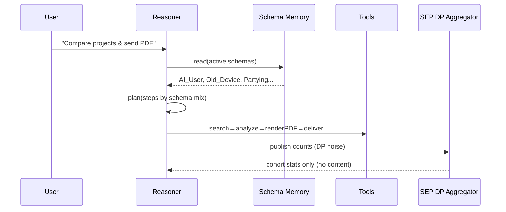
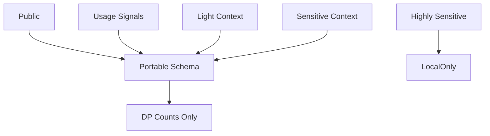

# NotefullBook — Schema‑First Cognitive Cloud

> **Mission:** _We don’t need to train on your life to help you live it._  
> A user‑owned **Schema Memory**, a small **Reasoner** that plans with it, and a **Schema Exchange Protocol** that shares only DP‑safe aggregates.

 

---

## Visual Overview

### 1) System Architecture
```mermaid
flowchart LR
  subgraph User["User Devices"]
    A[NotebookML App]-->B[Schema Memory (local)]
    A-->C[Local Tools: PDF, Mail, Drive]
  end
  B-- "schemas only" --> R[Reasoner (planner)]
  R-- "task plan" --> T[Tools / Skills]
  R-- "counts only" --> SEP[(Schema Exchange Protocol)]
  subgraph Cloud["Federated Services"]
    SEP-- "DP counts" --> AGG[(Aggregator)]
    AGG-- "benchmarks
leaderboard" --> Bench[Open Benchmarks]
    T-->Fn[Cloud Functions (optional)]
  end
  style SEP stroke:#222,stroke-width:2px,stroke-dasharray: 5 3
```

### 2) Federated Reasoning (FR) — Planning over Schemas


### 3) Privacy Model


---

## Quick Start

**Python demo (SchemaBench):**
```bash
cd python
python3 -m venv .venv && source .venv/bin/activate
pip install -r requirements.txt
bash scripts/run_all.sh
```

**Firebase Functions (SEP):**
```bash
cd firebase/functions
npm ci
npm run build
npm run serve   # emulator
# or deploy:
cd .. && firebase use YOUR_FIREBASE_PROJECT_ID
firebase deploy --only functions
```

**Test SEP:**
```bash
curl -X POST http://localhost:5001/YOUR_FIREBASE_PROJECT_ID/us-central1/sepAggregate/aggregate   -H "Content-Type: application/json"   -d '{"counts":{"AI_User":1234,"Old_Device":900,"Partying":250},"kAnon":100,"epsilon":0.5}'
```

---

## Repo Layout
```
python/     # SchemaBench (FR + SM + DP SEP stubs)
firebase/   # Cloud Functions: SEP endpoint
docs/       # Whitepaper, Privacy Manifesto, Model Card
api/        # OpenAPI spec for SEP
.github/    # CI, CodeQL, Scorecards, Releases
```

---

## Why this matters
- 🔒 **Privacy-first**: share **schemas & DP counts**, never raw content
- ♻️ **Lower carbon**: plan with small models; move less data
- 🔁 **Reproducible**: open benchmarks + CI-backed demos
- 🧩 **Composable**: bring your own tools (PDF, CRM, Drive)

## Cite
See `CITATION.cff`.
