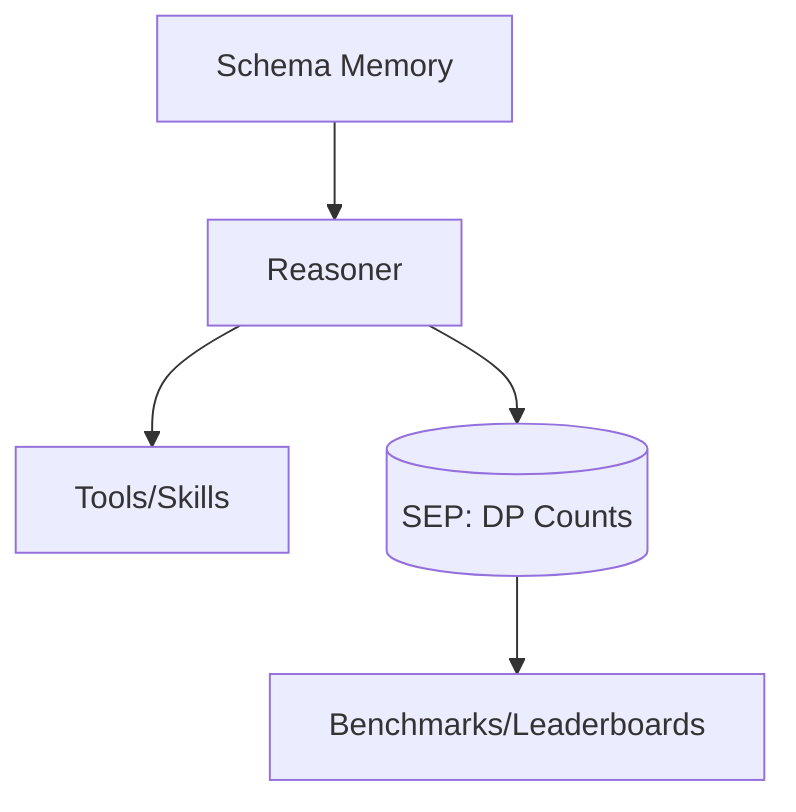

# Federated Reasoning over Schema-First Personal Contexts

## Abstract
Assistants need context without centralizing data. We introduce **NotefullBook**: a Schema Memory (SM), a small Reasoner that plans with it, and a Schema Exchange Protocol (SEP) that aggregates **DP-noised counts**, not content.

## Architecture (Mermaid)

